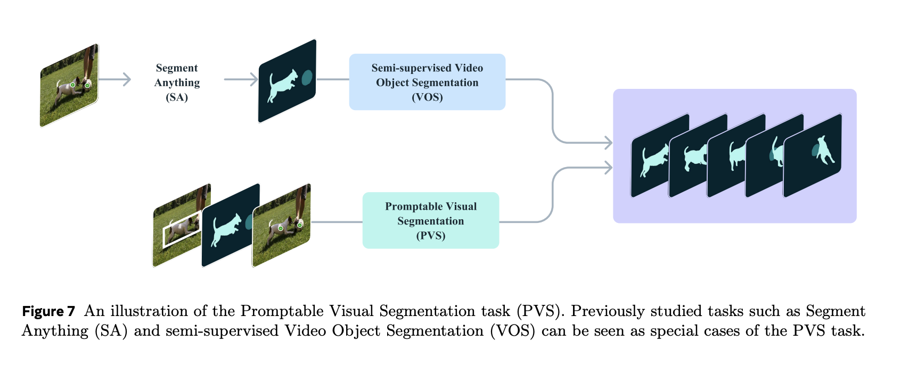
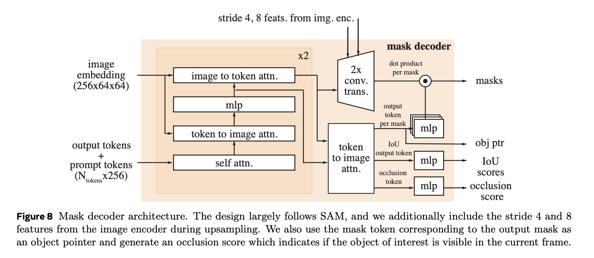
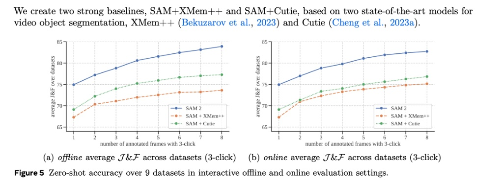

# Reality 2.0: Real-Time Video Object Editing (SAM 2)

Presenter: Kunyang Ji

Date: 2025.12.4

# 1. Overview:

**The Problem:** Computer vision has mastered static images, but video remains a challenge due to "Temporal Inconsistency." When editing video, if you identify an object (like a car) in Frame 1, current models often "lose" it by Frame 50 if it rotates, changes lighting, or goes behind a tree (occlusion). This makes automated video editing (VFX) impossible without manual frame-by-frame work.

**Proposed Approach:** This project implements Meta’s Segment Anything Model 2 (SAM 2). Unlike previous models that treat video as 3D blocks, SAM 2 treats video as a stream of images with a "Memory Bank." It allows users to click an object once, and the model propagates that selection through the entire video in real-time.



This graph illustrates the Promptable Visual Segmentation (PVS) task, showing how it generalizes both "Segment Anything" (images) and "VOS" (video) into a unified task.

# 2. Methdology:

**2.1. Theory**: The "Memory Attention" Mechanism 

We apply Transformer Attention mechanisms to the temporal dimension.

- Standard Transformers: Attend to all words in a sentence.

- SAM 2: Implements "Streaming Memory Attention." It maintains a "Memory Bank" (FIFO Queue) of the object’s embeddings from past frames. When processing the current frame, the model attends to these past embeddings to resolve ambiguity.

**2.2. Architecture Pipeline We utilize a unified pipeline consisting of three components:**


**Image Encoder (Hiera):** A hierarchical Vision Transformer that runs at ~44 FPS, converting video frames into feature maps.

**Memory Encoder:** Compresses the current mask prediction into a lightweight "memory token" and stores it.

**Mask Decoder:** Fuses the Current Frame + Memory Context + User Clicks to generate the final mask.



This is the internal "brain" of the model that generates the masks. It closely follows the Transformer architecture mentioned in your syllabus.

**Attention Mechanisms:** It uses Self-Attention (relating prompts to each other) and Cross-Attention (labeled "token to image attn" and "image to token attn") to mix the user's prompt with the image features.

**New Video Features:** Unlike the original SAM, this decoder has an "occlusion head" (bottom right). It predicts an occlusion score to tell the system if the object is currently hidden behind something else (e.g., a car driving behind a tree).


**2.3. Dataset-Driven Validation:** 
To ensure reliability, we validate this methodology using the SA-V (Segment Anything Video) dataset logic. We test the model's ability to handle "Disappearance/Reappearance" events, which occur in 42.5% of SA-V tracks, ensuring our approach works in the real world.

**2.4. Connecting to "Transformer Components" & "Architecture":**

- The Encoder (Hiera):

The Encoder takes raw input (like text tokens) and creates "Hidden states" or context. AndSAM 2 uses a Hierarchical Vision Transformer (Hiera) as its Image Encoder. Instead of tokenizing text, it tokenizes the video frame pixels. Just like the Encoder in your slide's Figure 3-1, it processes the input once to create a rich feature representation (embedding) that the decoder can query later.

- The Decoder (Mask Decoder):

The Decoder taking "Token embeddings" and "Hidden states" from the encoder to predict the "Next word". And SAM 2's Mask Decoder (Figure 8) takes the image embeddings (from the encoder) and user prompts (clicks/boxes). Instead of predicting the "next word," it predicts the "mask."


**2.5. Connecting to "Formal Algorithms" (Attention Mechanisms):**


- Self-Attention ($X$ attending to $X$):

Self-attention is defined as relating tokens within the same sequence to one another9. In SAM 2 (Figure 8), the block labeled "self attn." in Figure 8 allows the prompt tokens (e.g., if you click five times on a car) to communicate with each other. This helps the model understand that Click 1 and Click 2 are related parts of the same object.

- Cross-Attention ($X$ attending to $Z$):

The cross-attention (often in Encoder-Decoder blocks) is where the query comes from one sequence and keys/values come from another.In SAM 2 (Figure 8), the blocks labeled "token to image attn" and "image to token attn" are Cross-Attention layers.

- Query ($Q$): The user prompts (tokens).

- Key/Value ($K, V$): The image embeddings from the Image Encoder.

- This is how the model "looks" at the specific part of the image you asked about.


**2.6. Connecting to "Positional Embeddings" (RoPE):**

The "Positional embeds" are added to token embeddings so the model knows the order of words13. Standard Transformers use absolute positions ($1, 2, 3...$). And SAM 2 uses Rotary Positional Embeddings (RoPE) (specifically 2D-RoPE) for its memory attention.

- Why it matters: Standard embeddings struggle when sequence lengths change (like in long videos). RoPE (a concept likely covered in your "Llama 3.2 Deep-Dive" unit) encodes relative positions using rotation matrices. This allows SAM 2 to understand that "Frame 50 is 10 frames after Frame 40," regardless of how long the video is, facilitating the "Streaming Memory" architecture.
  

# 3. Implementation & Demos

**3.1. The Setup:** We use the sam2 Python library with the Hiera-Large checkpoint for maximum accuracy.

**3.2. Code Walkthrough:**
```
import torch
from sam2.build_sam import build_sam2_video_predictor

# 1. Load the Model (Applying Pre-trained Weights)
checkpoint = "./checkpoints/sam2_hiera_large.pt"
predictor = build_sam2_video_predictor("sam2_hiera_l.yaml", checkpoint)

# 2. Initialize Video State
video_path = "./demo_video.mp4"
inference_state = predictor.init_state(video_path=video_path)

# 3. User Interaction (The Prompt)
# We provide a single positive click (Label 1) at coordinates X=200, Y=300 on Frame 0
_, _, mask_ids = predictor.add_new_points(
    inference_state=inference_state,
    frame_idx=0,
    obj_id=1,
    points=[[200, 300]],
    labels=[1],
)

# 4. Propagation Loop
# The model iterates through the video, updating its Memory Bank at each step
for out_frame_idx, out_obj_ids, out_mask_logits in predictor.propagate_in_video(inference_state):
    # Visualize the mask overlay on the original frame
    show_mask(out_mask_logits, out_frame_idx)
```

# 4. Assessment & Evaluation:


**4.1.Model Version & Architecture:** 
- Version: SAM 2 (and SAM 2.1).

- Architecture:  A unified Transformer architecture with a streaming memory mechanism for real-time video processing.

- Core Components:

Image Encoder:  Uses a Hiera (Hierarchical Vision Transformer) backbone to process frames.

Memory Attention: Allows the model to attend to past frame features and predictions stored in a Memory Bank (FIFO queue).

Mask Decoder:  Generates segmentation masks based on user prompts (clicks/boxes) and memory context.

We evaluate SAM 2 against previous State-of-the-Art (SOTA) models on three standard industry datasets to prove reliability.


**4.2. Intended Uses & License:**

- Primary Use: Promptable visual segmentation for images and videos (e.g., visual editing, robotic perception, data annotation).

- License: Released under the permissive Apache 2.0 License.

- Dataset License: The SA-V dataset is released under CC BY 4.0.

- Prohibited Uses:*Surveillance, military applications, or generating biometric/sensitive personal data without consent.


**4.3. Ethical & Bias Considerations:** 

- Fairness Evaluation: The authors conducted a fairness evaluation on the SA-V dataset and found minimal performance discrepancy across perceived gender and age groups.

- Geographic Diversity: The training data (SA-V) includes videos from 47 countries to ensure the model generalizes well across different global environments.

- Limitations: The model may still reflect biases present in the training data, and users are advised to perform their own fairness evaluations for specific use cases.




This figure compares the performance of SAM 2 against two strong baseline methods (SAM + XMem++ and SAM + Cutie) on zero-shot video segmentation tasks.

- **The Metrics (Y-Axis):** The vertical axis represents the "average $\mathcal{J} \& \mathcal{F}$ over datasets." $\mathcal{J} \& \mathcal{F}$ is a standard metric for segmentation quality, where higher is better.

- **The Input (X-Axis):** The horizontal axis shows the "number of annotated frames with 3-click." This simulates a user interacting with the video by clicking on objects to refine the mask. As the user annotates more frames (from 1 to 8), the model has more information to improve accuracy.

The Comparison:

- SAM 2 (Blue Line): Consistently achieves the highest accuracy across all interaction steps in both settings. It starts higher and improves steadily as more frames are annotated4.

- SAM + Cutie (Green Dotted Line): A strong baseline but consistently underperforms SAM 25.

- SAM + XMem++ (Orange Dashed Line): The lowest performing of the three, though it still improves with more interactions6.

- Key Takeaway: SAM 2 provides significantly better segmentation accuracy with fewer interactions compared to state-of-the-art baselines7.


| Dataset | Focus | SAM 2 Score (J&F) | vs. Previous Best |
| :--- | :--- | :--- | :--- |
| **DAVIS 2017** | Standard Benchmark | **90.7%** | +2.6% Improvement |
| **MOSE** | **Complex Occlusions** | **77.9%** | **+6.2% Improvement** |
| **YouTube-VOS** | Diverse Videos | **89.3%** | +1.8% Improvement |


The MOSE result is the most critical. MOSE (Complex Video Object Segmentation) specifically tests objects disappearing and reappearing. A 6.2% jump in accuracy here empirically proves that the Memory Attention methodology works better than previous approaches.


# 5. Model & Data Cards:
**Model Name:** Segment Anything Model 2 (SAM 2)

**Developer:** Meta FAIR (Fundamental AI Research)

**Release Date:** August 2024

**Training Data:** Trained on SA-V. It contains 51,000 videos and 643,000 masklets. It is 53x larger than previous datasets (like DAVIS), ensuring high reliability across different environments.


# 6. Critical Analysis:

**6.1. Impact:** The End of Rotoscoping This project reveals that manual video segmentation (rotoscoping), which historically took Hollywood studios weeks, is now a solved problem solvable in seconds. This lowers the barrier to entry for high-end VFX.

**6.2. Technical Insight:** Memory is Key The success of SAM 2 suggests that for Video AI, Architecture (Memory mechanisms) is more important than just Scale (more data). The ability to "remember" past tokens is what solves the occlusion problem, not just training on more videos.

**6.3. Limitations:** The model still struggles with "ID Switching" in crowded scenes (e.g., confusing two similar-looking people wearing the same shirt) and extremely thin, fast-moving objects (like spinning wheels) due to motion blur.

# 7. Conclusion: 

【need to edit】


# 8. Documentation & Resource Links:

**8.1. Setup Instructions To run this project locally:**

To run this project locally, you need to install PyTorch and the official SAM 2 library.

**1. Install Dependencies. **
First, install PyTorch and TorchVision (the libraries for Computer Vision).
```bash
pip install torch torchvision
```
**2. Clone the Repository Pull the official code from Meta's GitHub.**

```bash
git clone [https://github.com/facebookresearch/segment-anything-2.git](https://github.com/facebookresearch/segment-anything-2.git)
cd segment-anything-2
```

**3.Install the SAM 2 library in editable mode so Python can find it.**

```bash
pip install -e .
```

**4.Download the pre-trained model weights ("Hiera Large") that we use for the demo.**
```bash
cd checkpoints
./download_ckpts.sh sam2_hiera_large
cd ..
```


**8.2. Resource Links:**

Primary Paper: Ravi, N., et al. (2024). SAM 2: Segment Anything in Images and Videos. Meta FAIR.\
https://arxiv.org/pdf/2408.00714

Dataset: The SA-V Dataset. Meta AI. \
https://ai.meta.com/datasets/segment-anything-video/

Codebase: Official GitHub Repository. \
https://github.com/facebookresearch/segment-anything-2


